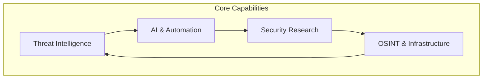
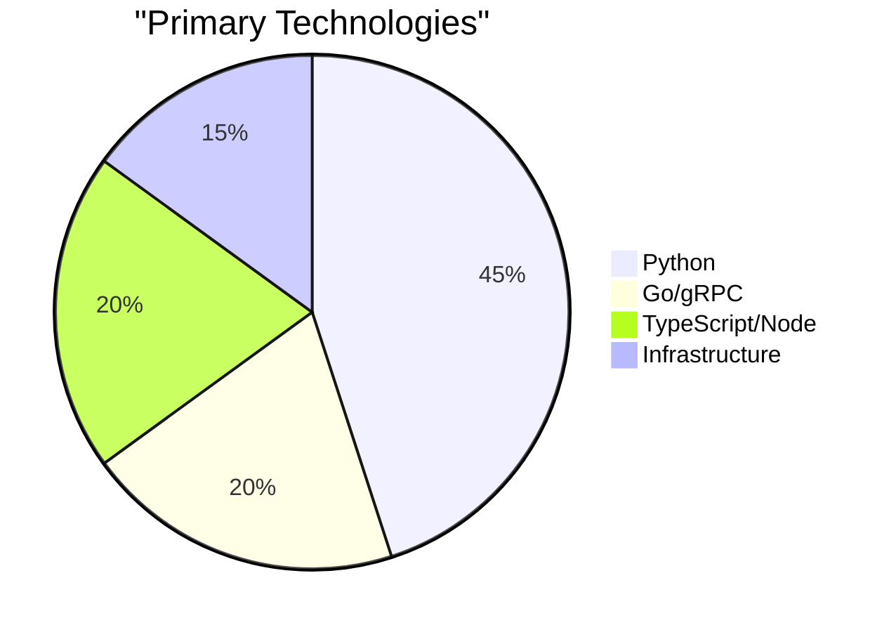
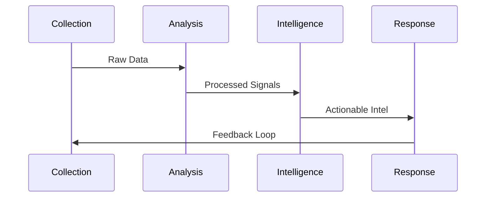

# Dark Code Labs

**Security Research • Threat Intelligence • Advanced Tooling**

---

## Mission

Dark Code Labs is dedicated to advancing security research and developing sophisticated threat intelligence platforms. We build tools that empower security researchers, defenders, and analysts to stay ahead of emerging threats.

## Focus Areas

## Technology Stack

## Research Pipeline

## Capabilities

### Threat Intelligence
Advanced threat intelligence aggregation, signal processing, and correlation engines that transform raw security data into actionable insights.

### AI-Powered Security
Intelligent automation and orchestration systems that leverage machine learning to enhance security operations and response workflows.

### Security Research
Frameworks and tooling for security testing, vulnerability research, and exploitation analysis in authorized environments.

### Infrastructure & OSINT
Secure protocols, intelligence gathering frameworks, and data collection infrastructure for comprehensive security visibility.

## Get Involved

We're building the future of security tooling:

- **Star** our public projects to show support
- **Report Issues** to help us improve
- **Contribute** to open repositories
- **Share** knowledge with the security community

## Connect

- **GitHub**: [@darkcodelabs](https://github.com/darkcodelabs)
- **Public Repositories**: Browse our [public projects](https://github.com/orgs/darkcodelabs/repositories?type=public)

---

**Built by security researchers, for security researchers**

*Empowering defenders through advanced tooling and threat intelligence*

