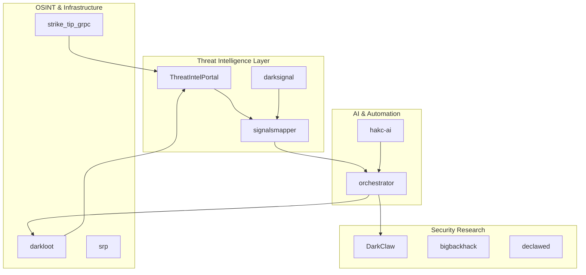
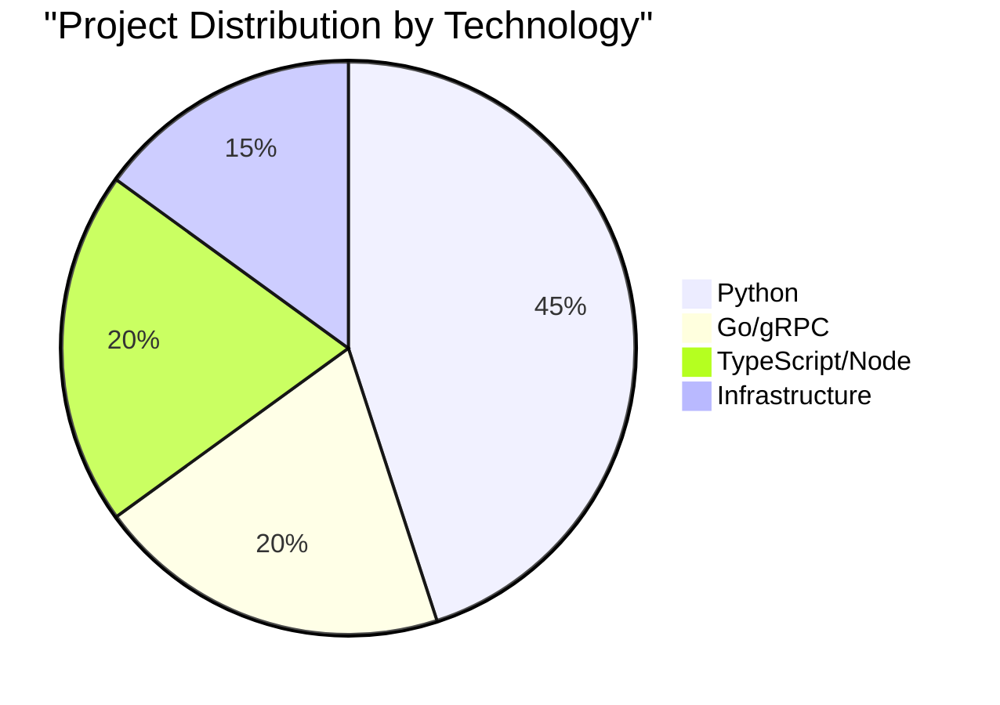
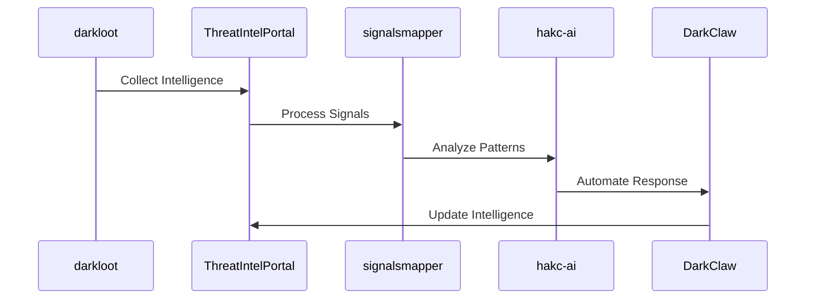

# Dark Code Labs

**Security Research • Threat Intelligence • Advanced Tooling**

---

## Mission

Dark Code Labs is dedicated to advancing security research and developing sophisticated threat intelligence platforms. We build tools that empower security researchers, defenders, and analysts to stay ahead of emerging threats.

## Architecture Overview

## Core Projects

### Threat Intelligence
- **[ThreatIntelPortal](https://github.com/darkcodelabs/ThreatIntelPortal)** - Comprehensive threat intelligence aggregation and analysis platform
- **[darksignal](https://github.com/darkcodelabs/darksignal)** - Advanced signal processing for security events
- **[signalsmapper](https://github.com/darkcodelabs/signalsmapper)** - Threat signal mapping and correlation engine

### AI-Powered Security
- **[hakc-ai](https://github.com/darkcodelabs/hakc-ai)** - AI-driven security automation and analysis
- **[orchestrator](https://github.com/darkcodelabs/orchestrator)** - Intelligent security workflow orchestration

### Exploitation & Research
- **[DarkClaw](https://github.com/darkcodelabs/DarkClaw)** - Advanced exploitation framework
- **[declawed](https://github.com/darkcodelabs/declawed)** - Security testing and validation tools
- **[bigbackhack](https://github.com/darkcodelabs/bigbackhack)** - Large-scale security research toolkit

### OSINT & Reconnaissance
- **[darkloot](https://github.com/darkcodelabs/darkloot)** - Open-source intelligence gathering framework

### Infrastructure
- **[srp](https://github.com/darkcodelabs/srp)** - Secure remote protocols
- **[strike_tip_grpc](https://github.com/darkcodelabs/strike_tip_grpc)** - gRPC-based threat intelligence sharing
- **[threatportal](https://github.com/darkcodelabs/threatportal)** - Threat data portal and API

## Technology Stack

## Workflow Integration

## Get Involved

We're building the future of security tooling. Here's how you can participate:

- **Star** our projects to show support
- **Report Issues** to help us improve
- **Contribute** code, ideas, or documentation
- **Share** our tools with the security community

## Connect

- **GitHub**: [@darkcodelabs](https://github.com/darkcodelabs)
- **Issues**: Found a bug? [Open an issue](https://github.com/darkcodelabs)
- **Collaboration**: Interested in contributing? Check our repositories for open issues

---

**Built by security researchers, for security researchers**

*Empowering defenders through advanced tooling and threat intelligence*

